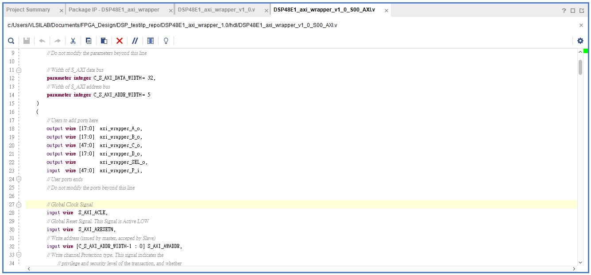

Connected Software with Vivado Generate IP
====
## 目的
本次實驗要教各位如何與 vivado block design 生成的 IP 溝通(software)以 DSP48E1 為例。
## 實驗步驟
Step 1. Create a new project

請回顧 Lab03 Step3，加入 DSP48 IP，其設定如下圖。

Step 2. Create new AXI IP

請回顧 Lab05 的教學，在原先的 project 中產生一個 AXI4 IP。

本次 AXI IP 主要是修改 AXI wrapper 的 I/O 部分，新增與 DSP 的連線 port，如下圖。

將 reg_data_out 連接至 DSP 的輸出，提供 ARM software 讀取，如下圖。

將 AXI wrapper 的 output 部分連接至 DSP 的輸入，使 ARM software 可以將資料丟入DSP中運算，如下圖。

上圖中，註解的部分以 software 提供資料以及指令，透過自己設計的 RTL 模組將資料依照 DSP 讀取的方式輸出。

將 AXI 最上層的 wrapper 加上 AXI IP 之 GUI 的 I/O port ，這部分的 port 主要是與 DSP 做溝通使用，如下圖。

並且於下方連接模組的部分加上 AXI wrapper 所新增的 port ，如下圖。

最後將AXI IP package，其GUI會如下圖。

Step 3. Block Design

create new IP 前的 project，refresh 加入的 IP，其 block design 如下圖。

Step 4. H/S communication

請回顧 Lab05 Step3，建立 software 與 DSP 的溝通，如下圖。

其執行結果如下圖。

