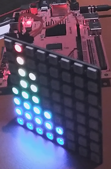
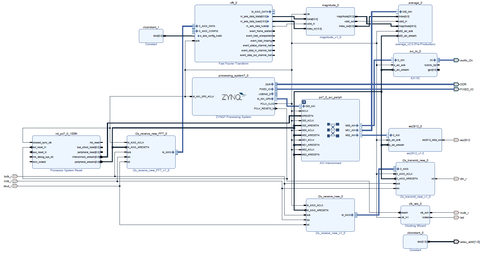
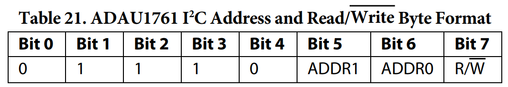
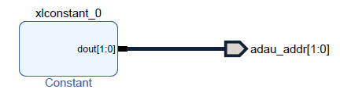
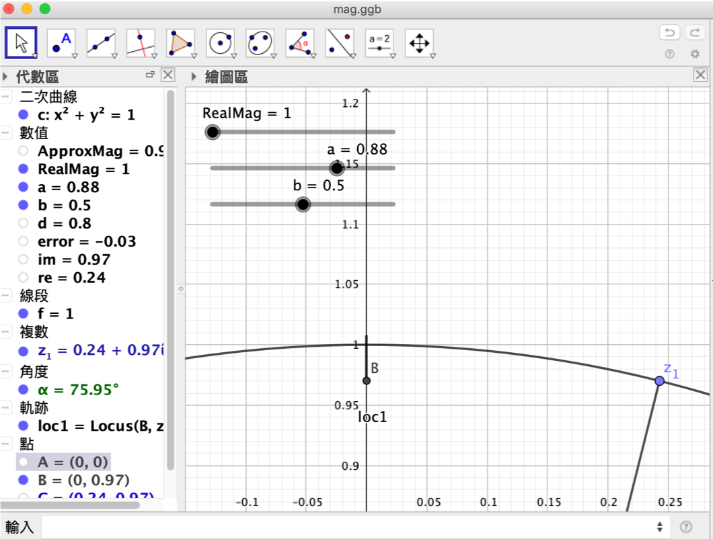
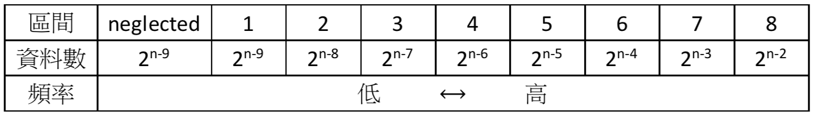

FPGA-based System Design - Final Project  
Simple Frequency Displayer
=

* [Member](#Member)
* [Program](#Program)

<h2 id="Member">Member</h2>

- E24056572   
- E24056637   
- E24054203   

<h2 id = "Program1">Program</h2>

### Brief Introduction

本專案為一個簡易的頻譜展示器，頻譜的展示方式為8*8LED矩陣。  
訊號透過音源線輸入，在PYNQ-Z2的板子上有一塊音訊的編解碼器ADAU1761，硬體讀取音訊晶片的取樣結果後，經過快速傅立葉變換再計算各頻帶相對應的強度之後，在LED上顯示出來。

### Open Source IP

- Vivado Fast Fourier Transform v9.1
- Vivado AXI IIC Bus Inteface v2.0
- Vivado Clocking Wizard v5.3
- WS2812 Controller

### Custom Module

- Complex Number Magnitude Calculator
- Average Calculator
- I2S Receiver -data format designed for I2S Transmitter
- I2S Receiver -data format designed for FFT core
- I2S Transmitter

### Extra Hardware

- WS2812 8*8 LED Matrix
  

### Block Design

### Design Detail

#### Adau1761

Adau1761為PYNQ-Z2上預載的音訊處理晶片，在本次實作中我們將它設置為取樣率48KHz、ADC取樣長度24bit。  
此晶片的設定方式是透過I2C寫入內部暫存器，I2C地址也是可以設定的，此處我們通過硬體固定其地址。

 
  

上圖的Constant設為0，因此I2C地址固定為0x38+R/W bit。  
而參數的設定為了方便我們選擇使用軟體控制。
以下是在本專案中相關參數的設定值(參數的設定需要按照以下順序逐一進行)

|  Register       |    Value        | Function                                       
| ----------------|-----------------|----------------------------------------------
|  0x4000         | 0x0E            | Set PLL input clock to 1024 * fs
|  0x4002         | 0x007D000C2301  | Set Sample Rate 48KHz(fs)
|  0x4000         | 0x0F            | Enable PLL input clock
|  0x4015         | 0x01            | Set adau1761 to I2C master
|  0x400A         | 0x01            | Enable left mixer
|  0x400B         | 0x05            | Left mixer input gain 0dB
|  0x400C         | 0x01            | Enable right mixer
|  0x400D         | 0x05            | Right mixer input gain 0dB
|  0x4014         | 0xA0            | Noise gate config (-76.5dB, Fade then mute)
|  0x401C         | 0x21            | Playback left mixer unmute
|  0x401E         | 0x41            | Playback right mixer unmute
|  0x4023         | 0xe7            | Enable headphone output left
|  0x4024         | 0xe7            | Enable headphone output right
|  0x4025         | 0xe7            | Enable line out left
|  0x4025         | 0xe7            | Enable line out right
|  0x4019         | 0x23            | Enable both ADCs
|  0x4029         | 0x23            | Enable playback both channels
|  0x402A         | 0x03            | Enable both DACs
|  0x40F2         | 0x01            | Serial input L0,R0 to DAC L,R
|  0x40F3         | 0x01            | Serial output ADC L,R to serial output L0,R0
|  0x40F9         | 0x7F            | Enable clocks to all engines

#### Clocking Wizard

Adau1761中的鎖相迴路之鎖定時間與該晶片接受的額外Master clock有關，而本專案中MCLK為24MHz，由Vivado提供的Clocking Wizard產生。相對應的鎖定時間約為2.95毫秒，因此在設定完音訊晶片的時間設定(Register 0x4002 與 Register 0x4000)後需要等待2.95毫秒才能再進行其他設定。

#### I2S receiver and transmitter

由於adau1761取樣後的輸出為I2S格式，因此本專案中我們參考網路上的資源設計了I2S的收發模組。  
再本專案中，音訊有兩條行進路線，第一條是I2S接收器將接受到的訊號送給I2S發送出去，使用者可以透過耳機聽到輸入的音訊；第二條是I2S接收器將接受到的訊號送給快速傅立葉變換進行頻譜分析。  
由於FFT的輸入格式是AXI Stream且音訊也是一種Stream，因此I2S收發摸組都使用AXI Stream的格式來傳遞資料。  
需要注意的是，I2S是一種以MSB優先且一次送出一個bit的傳遞協定，因此送到FFT的資料要先經過bit reverse，所以針對FFT所需要的格式我們額外設計了一個I2S Receiver FFT。  

#### Fast Fourier Transform

#### Magnitude and Average

FFT運算的結果為複數，
為了避免過多複雜的運算，
複數的大小(Magnitude)主要用以下估計法計算

M = Max(Re,Im)
Magnitude = Max( M, 0.375 M + 0.5(Re+Im))

此估計法與實際算法的誤差最多是1-(16/17)^0.5 ≒ 3%
  

為了在WS2812 8x8 LED Matrix 顯示頻譜，我們依據音調的原理，以及FFT運算結果的對稱性，
取FFT運算結果數(2^n)的前0.5個 ( 2^(n-1) ) ，
並忽視部分低頻————前2^(n-9)筆資料————將剩下的資料分成8個區間，
每個區間的資料數成等比數列，如下圖
  

各區間分別取平均，即為該區間的頻譜大小。

平均值取法：Logarithmic Averages
http://code.compartmental.net/2007/03/21/fft-averages/

#### WS2812

