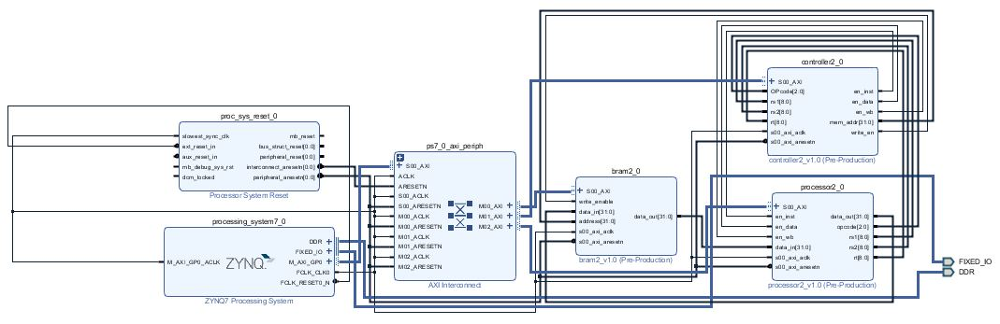

FPGA_Design Lab06 HW
====

# 成員名單
E24041810 E24046755 E24046307 

# block diagram

# Program 1.
### 設計一個矩陣運算的處理器，可做乘法，加法，減法，轉置，行列式運算。
### 設計說明
1. 指令格式:32bits  
    31~29:OPcode//0 for add; 1 for sub; 2 for mul; 3 for trans ; 4 for det
	28~20:rs1//第一個矩陣的第一個資料位址  
	19~11:rs2//第二個矩陣的第一個資料位址  
	10~2 :rt//運算完結果存入的位址  
	1~0  :沒有用到  
	
2. processor.v說明:  
    當en_inst為1時，輸入的data將被視為instruction並進行解碼，將解碼後的結果傳給controller，  
	當en_data為1時，輸入的data將被視為data並依據OPcode進行運算  
	當en_wb為1時，會將資料傳出去  
	
3. controller.v說明:  
    為一FSM架構，分成五個state，分別是IF、ID、MEM、EXE、WB，IF為抓取指令，ID為解碼，MEM為從BRAM搬取資料，EXE進行運算，
	WB為將資料寫回BRAM。  
	
4. main.c說明:
    我們在這裡頭有測試過，從SDK存入BRAM的data是正確的，但在硬體(processor)無法抓到正確的資料，詳細情形如第5點所述。  

5. 遇到的問題:
    因為我們不太清楚BRAM裡面的base addr是如何設置的，因此無法正確抓取指令，故而造成結果錯誤，且因為時間不太充裕，
	又面臨期中考週，所以就算我們花了好多心力卻依舊無法完成本次作業的要求。  

