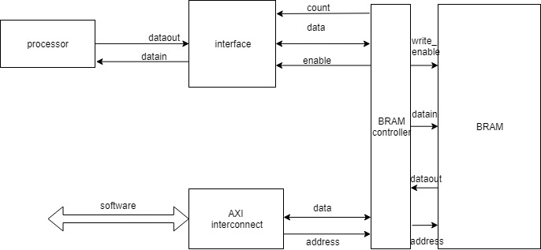
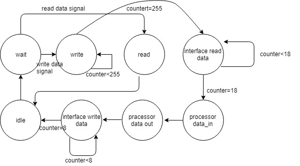

# Homework 6
## Member

E24056580
E24045173
E24053037

##  Program 
### 設計
這次實驗我們block design有一點不一樣
我們把control通通寫在一個.v檔中
如下圖所示
	//圖片一
	

	
接著我們的controller是一個狀態機
以下是狀態圖
//圖片二

我們processor部分設計成只能處理3*3矩陣

最後，BRAM需要分成data跟instruction
我們規劃data從記憶體的上方往下存(從address[0]開始)
instruction從下方開始存(從address[255]開始)
由於這次作業只需要用到一個instruction
因此我們只要判定到address[255]被寫入資料
就開始進行運算(如上面狀態圖所示)

### 使用說明

軟體端依序輸入A矩陣 (9個數字)
接著輸入B矩陣 (9個數字)
**最後才能輸入所需的運算子**
|  0| 乘法 |
|--|--|
|  1| 加法 |
|  2| 減法 |
|  3| 轉製 |
|  4| 行列式 |

## 結果
很遺憾我們這次作業沒做成功
所以只能交屍體
data輸入之後不知道跑去哪邊了
對於debug的方法還不太熟練
下次會再改進QQ
