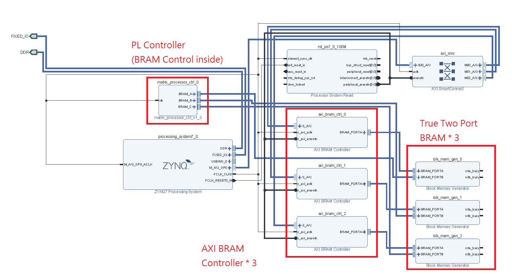

FPGA-based System Design - Lab06 HW
=

* [Member](#Member)
* [Program1](#Program1)

<h2 id="Member">Member</h2>

- E24056572   
- E24056637   
- E24054203   

<h2 id = "Program1">Program1 </h2>

<h3>Introduction</h3>

<h4>Block Design</h4>

我們有更改部分的架構，使用了三個True Two Port的BRAM，PS與BRAM的溝通由AXI BRAM Controller負責，PL與Controller則不需要額外的Interface，因為BRAM本身就是在PL裡面了，統一由Controller發送讀寫訊號。

會不使用助教提供的BRAM Controller與BRAM是因為為了要同時讓PS與PL存取BRAM的資料，需要使用到Two Port的BRAM，因此我們選擇的是Vivado提供的兩個IP。  

這次寫Controller的人員與其他組員沒有配合好，所以很多部分尚未完成，目前只有加法與減法功能有實作。

<h3>Programming</h3>

<h4>Determinant<h4>
方陣的determinant會等到全部的資料輸入至Determinant.v中再運算。

運算determinant的核心是Gaussian&nbsp;elimination(或是Bareiss&nbsp;Algorithm)

https://en.wikipedia.org/wiki/Bareiss_algorithm 
https://en.wikipedia.org/wiki/Gaussian_elimination 

Original 
0&nbsp;2&nbsp;1&nbsp;2 
2&nbsp;2&nbsp;1&nbsp;1 
0&nbsp;2&nbsp;1&nbsp;1 
0&nbsp;1&nbsp;1&nbsp;1 
 

&nbsp;0&nbsp;&nbsp;2&nbsp;&nbsp;1&nbsp;&nbsp;2 
[2]&nbsp;2&nbsp;&nbsp;1&nbsp;&nbsp;1 
&nbsp;0&nbsp;&nbsp;4&nbsp;&nbsp;2&nbsp;&nbsp;2&nbsp; 
&nbsp;0&nbsp;&nbsp;1&nbsp;&nbsp;1&nbsp;&nbsp;1&nbsp; 
 

[2]&nbsp;2&nbsp;&nbsp;1&nbsp;&nbsp;1 
[2]&nbsp;-4&nbsp;-2&nbsp;-4 
&nbsp;0&nbsp;&nbsp;4&nbsp;&nbsp;2&nbsp;&nbsp;2 
&nbsp;0&nbsp;&nbsp;1&nbsp;&nbsp;1&nbsp;&nbsp;1 
 

[2]&nbsp;2&nbsp;&nbsp;1&nbsp;&nbsp;1 
[2]&nbsp;-4&nbsp;-2&nbsp;-4 
&nbsp;0&nbsp;[4]&nbsp;2&nbsp;&nbsp;2 
&nbsp;0&nbsp;&nbsp;1&nbsp;&nbsp;2&nbsp;&nbsp;2 
 

[2]&nbsp;&nbsp;&nbsp;2&nbsp;&nbsp;&nbsp;1&nbsp;1 
[2]&nbsp;[-4]&nbsp;-2&nbsp;-4 
&nbsp;0&nbsp;&nbsp;&nbsp;[4]&nbsp;&nbsp;0&nbsp;8 
&nbsp;0&nbsp;&nbsp;&nbsp;&nbsp;1&nbsp;&nbsp;&nbsp;2&nbsp;2 
 

[2]&nbsp;&nbsp;&nbsp;2&nbsp;&nbsp;&nbsp;1&nbsp;&nbsp;1 
[2]&nbsp;[-4]&nbsp;-2&nbsp;&nbsp;1 
&nbsp;0&nbsp;&nbsp;&nbsp;[4]&nbsp;[2]&nbsp;2 
&nbsp;0&nbsp;&nbsp;&nbsp;&nbsp;1&nbsp;&nbsp;&nbsp;2&nbsp;{16} 
 

determinant=16x2x(-4)x2÷4÷2=2

<h3>Result</h3>
